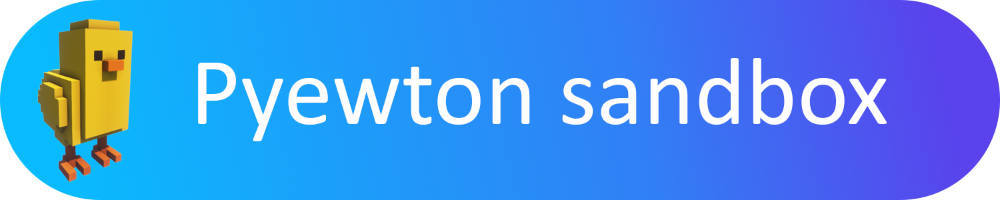

### <div align='center'> Un simulateur d'interactions gravitationnelles en 2D
---

# Installation  

## Prérequis :
* Système d'exploitation : Windows 10 et ultérieurs
* Python version 3.7 et ultérieurs (d'autres versions peuvent fonctionner mais n'ont pas été testées)
* Carte graphique supportant OpenGL 3.3 (des pilotes graphiques trop anciens peuvent poser des problèmes)

## Installation : 
### Récupérer le code : 
* Télécharger la dernière version stable du code source [ici](https://github.com/helloHackYnow/Pyewton-Sandox-release/releases/)
* Extraire le code source 

### Installer les dépendances : 
(Veillez à posséder la dernière version de pip)
* Ouvrir une invite de commande et naviguer jusqu'au dossier où vous avez extrait le code source:  
```
cd C:\chemin\jusqu'au\dossier
```
* Installer les modules nécessaires : 
```
py -m pip install -r requirements.txt
```
> ⚠️ Si vous avez plusieurs versions de python installées, faites attention à laquelle vous executez.  
> Par exemple, pour spécifier la version 3.10:
>````
>py -3.10 -m pip install -r requirements.txt
>````
